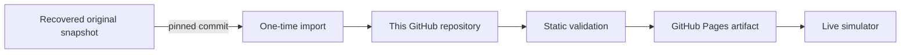

<p align="center">
  
</p>

<h1 align="center">Pandora Saga Simulator — Restored</h1>

<p align="center">
  A preservation-focused, standalone restoration of the legacy <strong>Pandora Saga Simulator</strong><br>
  formerly hosted at <code>pansaga3.web.fc2.com/simu/</code>.
</p>

<p align="center">
  <a href="https://bonaqu.github.io/Pandora-Saga-Simulator-remaked/"></a>
  <a href="https://github.com/bonaqu/Pandora-Saga-Simulator-remaked/actions/workflows/pages.yml"></a>
  
  
</p>

> [!IMPORTANT]
> This repository is an independent preservation/restoration project. It is not an official Pandora Saga project and is not affiliated with the original game publisher or operators.

## 🎮 Live simulator

**https://bonaqu.github.io/Pandora-Saga-Simulator-remaked/**

The deployed simulator is self-contained in this repository: HTML, JavaScript, CSS, data tables and item/skill images are served from this GitHub repository through GitHub Pages. The original FC2 host is **not required at runtime**.

## ✨ What is preserved

- Original legacy calculator layout and interaction model.
- Character/status calculations from the recovered client-side scripts.
- Equipment, item, skill and option data bundled with the original simulator snapshot.
- English / Japanese / Traditional Chinese language selection already present in the legacy client.
- Legacy keyboard shortcuts and the original light-style themes.
- Static hosting: no PHP, database, account or server is required.

The restored snapshot identifies itself as **Pandora Saga Simulator 2.00** and contains the original client-side calculation files such as `calc.js`, `equip.js`, `item.js`, `skill.js` and `ini.js`.

## 🧭 Repository map

```text
.
├── index.html            # restored simulator entry point
├── css/                  # original simulator styles
├── js/                   # original calculator/data logic
├── image/                # original icons/assets
├── docs/                 # FAQ, history, deployment & architecture
├── scripts/              # restoration/validation helpers
├── .github/workflows/    # GitHub Pages + preservation automation
├── SOURCE.lock           # exact upstream snapshot provenance
└── README.md
```

The original binary assets are imported automatically once, committed into this repository, and then served locally from here.

## 📚 Documentation

| Document | What it contains |
|---|---|
| [FAQ](docs/FAQ.md) | Browser support, data, Cloudflare/DB questions, troubleshooting |
| [History & provenance](docs/HISTORY.md) | Where the recovered copy came from and what was changed |
| [Architecture](docs/ARCHITECTURE.md) | How the static simulator works |
| [Deployment](docs/DEPLOYMENT.md) | GitHub Pages workflow and maintenance |
| [Preservation notice](NOTICE.md) | Attribution and redistribution note |

A best-effort GitHub Wiki synchronization is also included in the Pages workflow. The canonical documentation remains in `docs/` so it can never disappear separately from the source code.

## 🏗️ How restoration works



The first Pages run imports the recovered original snapshot from a **pinned commit**, removes only obsolete FC2 hosting injection from the HTML, stores the result in this repository and commits a `SOURCE.lock` provenance file. After that, the deployed site no longer depends on FC2 or on the recovery repository.

## 🧪 Integrity checks

Every deployment validates that:

- the main `index.html` exists;
- core calculator scripts are present;
- local JS/CSS resources referenced by the HTML exist;
- obsolete FC2 runtime footer injection is absent from the published entry point;
- core JavaScript files pass a syntax check.

If validation fails, GitHub Pages is not deployed.

## ☁️ Does it need Cloudflare or a database?

**No.** The recovered simulator is a fully client-side application. GitHub Pages is enough and costs nothing for this use case.

Cloudflare would only become useful if the project later adds server-side features such as shared build storage, accounts, public build links backed by a database, analytics endpoints or an API. None of that is required for the restored calculator itself.

## 🛠️ Local run

After the one-time source import has completed:

```bash
python -m http.server 8000
```

Then open:

```text
http://localhost:8000/
```

## 🕹️ Legacy shortcuts

The recovered README documents keyboard controls for level, attributes and skill families. See [FAQ → Keyboard shortcuts](docs/FAQ.md#keyboard-shortcuts) for the readable list.

## 🤝 Contributing

Bug reports for broken calculations, missing images, encoding problems or browser regressions are welcome through GitHub Issues. Please include the selected language, class/build, browser and the shortest reproducible sequence.

## 📜 Attribution / preservation

The recovered simulator README credits the original author as **z_anthurium** and explicitly states:

> “Feel free to modify and redistribute.”

The recovery source used for preservation is pinned in `SOURCE.lock`; this repository does **not** claim authorship of the original Pandora Saga Simulator or its game assets. See [NOTICE.md](NOTICE.md) for details.

---

<p align="center"><sub>Preserved so a dead host does not take a useful game tool with it.</sub></p>
