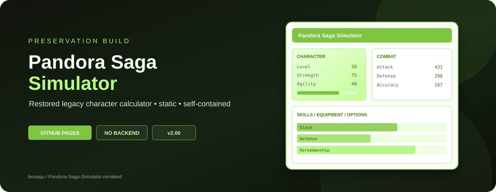

  <strong>English</strong> · <a href="README.ru.md">Русский</a>

  

<h1 align="center">Pandora Saga Simulator — Remaked</h1>

  A restored and modernized character simulator for <strong>Pandora Saga</strong>, preserving the behavior of the legacy 2.00 calculator while making it easier to use on current browsers and screens.

  
  

## 🎮 About

**Pandora Saga Simulator Remaked** brings the old browser-based Pandora Saga character calculator back to life and gradually modernizes the experience without replacing its original calculation logic.

The project is made for players who want to experiment with classes, attributes, skills, equipment and other character settings without depending on the long-dead original FC2 page.

## ✨ Modern Mode

The main site opens in **Modern Mode**:

- refreshed Hybrid Light interface inspired by the original green simulator;
- English interface by default;
- Japanese and Traditional Chinese legacy data remain available;
- responsive application shell for desktop, ultrawide, tablet and phone screens;
- **Equipment Search** with name and level filters over the current compatible legacy options;
- **Soul Search** for currently available sockets and compatible legacy Soul options;
- automatic local autosave with recovery after refresh;
- **Build Manager** for named local builds: save, load, rename, duplicate and delete;
- import/export using the simulator's existing serialized build code;
- **Compare Builds** for side-by-side stats from two saved builds, including neutral `Build B − Build A` deltas;
- keyboard-accessible stat help that explains what a displayed value represents and identifies its exact Legacy 2.00 output node;
- a compact sticky character summary and collapsible detail cards on phone screens;
- an installable PWA shell with reliable offline boot for both Modern and Legacy routes;
- a non-blocking update notice that lets you finish or save work before reloading;
- all Remaked autosaves and named builds stay local to the current browser in this release.

Compare Builds does not replace the calculator formulas. Both sides are evaluated through the preserved legacy calculation path, and the current active character is restored afterwards. Stat help intentionally does **not** invent detailed attribute/equipment/buff formula breakdowns where those components have not been verified.

**Open Modern Mode:**  
https://bonaqu.github.io/Pandora-Saga-Simulator-remaked/

## 🕰️ Legacy Mode

Want the old simulator exactly the way longtime users remember it? The preserved **Legacy Mode** remains available separately as a historical reference and compatibility baseline.

**Open Legacy Mode:**  
https://bonaqu.github.io/Pandora-Saga-Simulator-remaked/legacy/

## 🌐 Languages

| Language | Status |
|---|---|
| English | Default |
| 日本語 | Available through the legacy data |
| 繁體中文 | Available through the legacy data |
| Русский | In development; game terminology will be verified against the Russian client |

## 🚧 What's coming next

The modernization roadmap includes:

- full Russian localization with verified in-game terminology;
- reproducible structured-data projections while keeping the legacy engine as the calculation source of truth.

See [CHANGELOG.md](CHANGELOG.md) for released changes and current progress.

## 🐛 Report a problem

Found an incorrect stat, broken control, missing item, bad translation or browser issue? **Report it through GitHub Issues** and include the shortest steps that reproduce the problem.

[Open a bug report](https://github.com/bonaqu/Pandora-Saga-Simulator-remaked/issues/new?template=bug_report.yml)

## 📌 Project status

- **Legacy engine:** Pandora Saga Simulator 2.00
- **Remaked UI:** 2026.09.4
- **Hosting:** GitHub Pages
- **Project:** community preservation / modernization project

> This is an independent, unofficial project. It is not affiliated with the original Pandora Saga publisher or operators. Original Pandora Saga names, imagery and game assets belong to their respective rights holders. The recovered legacy simulator retains its historical attribution and permissions; new Remaked additions are covered separately by this repository's [LICENSE](LICENSE) and [NOTICE](NOTICE.md).

---

A useful Pandora Saga tool should not disappear just because its old host did.

