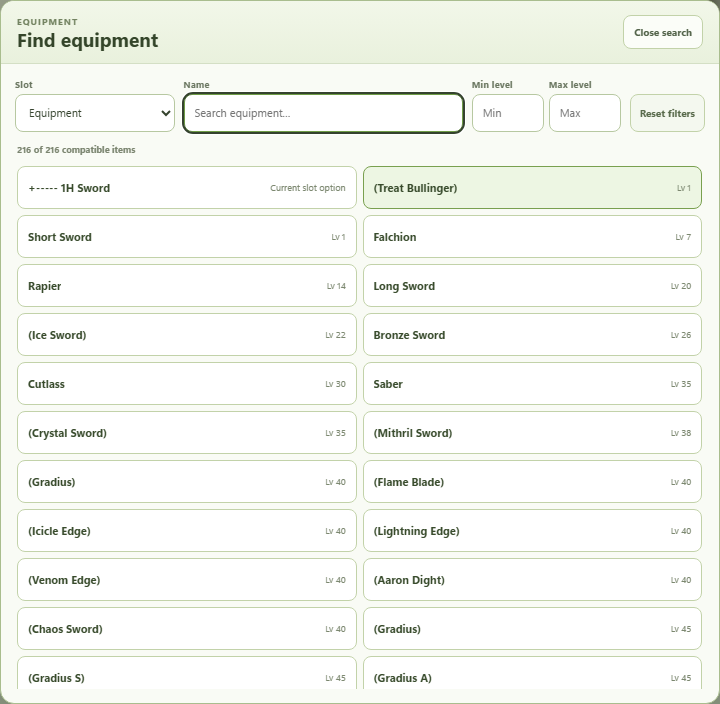
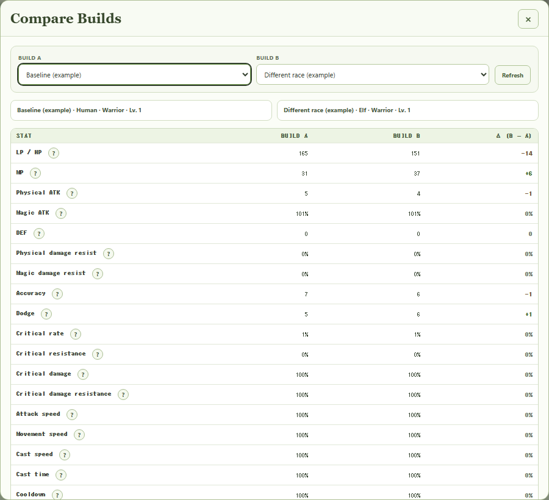
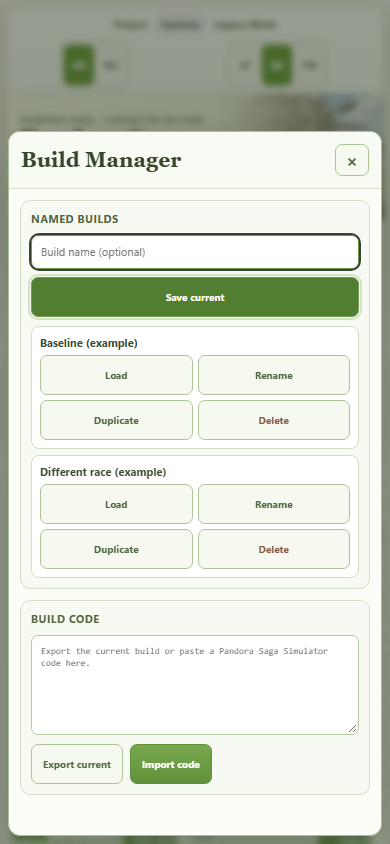

  <a href="README.md">English</a> · <strong>Русский</strong>

  

<h1 align="center">Pandora Saga Simulator — Remaked</h1>

  Восстановленный и постепенно модернизируемый симулятор персонажа для <strong>Pandora Saga</strong>, который сохраняет поведение старого калькулятора версии 2.00, но становится удобнее на современных экранах и браузерах.

  
  

## 🎮 Что это

**Pandora Saga Simulator Remaked** возвращает к жизни старый браузерный калькулятор персонажа Pandora Saga и постепенно обновляет его интерфейс, не заменяя исходную расчётную логику.

Проект предназначен для игроков, которые хотят экспериментировать с классами, характеристиками, навыками, экипировкой и другими настройками персонажа без зависимости от давно недоступной страницы FC2.

## ✨ Современный режим

Главная страница открывается в **Modern Mode**:

- обновлённый светлый гибридный интерфейс в духе оригинального зелёного симулятора;
- английский язык по умолчанию;
- сохранены японские и традиционные китайские данные старой версии;
- адаптивная оболочка для обычных мониторов, широких экранов, планшетов и телефонов;
- **поиск экипировки** по текущим совместимым вариантам старого симулятора с фильтрами по названию и уровню;
- **поиск Soul** для доступных сокетов и совместимых вариантов из старого симулятора;
- автоматическое локальное сохранение билда и восстановление после обновления страницы;
- **Build Manager** для именованных локальных билдов: сохранить, загрузить, переименовать, скопировать и удалить;
- импорт и экспорт через существующий сериализованный код билда;
- **Compare Builds** для сравнения характеристик двух сохранённых билдов рядом, включая нейтральную разницу `Билд B − Билд A`;
- доступные с клавиатуры подсказки по характеристикам: что показывает значение и из какого точного узла Legacy 2.00 оно читается;
- переход сразу к калькулятору с клавиатуры и модальные окна, которые удерживают фокус внутри и возвращают его к кнопке открытия по Escape;
- окно **Обновления** на сайте: отдельные версии Legacy и интерфейса, краткие изменения и полный changelog;
- компактная закреплённая сводка персонажа и сворачиваемые подробные блоки на телефонах;
- устанавливаемый PWA-интерфейс с надёжным офлайн-запуском Modern и Legacy Mode;
- ненавязчивое уведомление об обновлении, которое позволяет сначала закончить или сохранить работу;
- отдельный переключатель интерфейса EN/RU; выбор JP/EN/TW по-прежнему управляет только сохранёнными игровыми данными;
- в этой версии автосохранения и именованные билды хранятся только в текущем браузере.

Compare Builds не подменяет формулы игры собственной математикой: оба билда рассчитываются через сохранённый старый расчётный путь, после чего активный персонаж восстанавливается. В подсказках намеренно нет выдуманной детализации формул по статам, экипировке или баффам, если такие составляющие не были отдельно подтверждены.

**Открыть Modern Mode:**  
https://bonaqu.github.io/Pandora-Saga-Simulator-remaked/

## Как это выглядит

Реальные экраны Modern Mode из опубликованной версии `2026.09.9`. Для сравнения взяты два примерных билда с разными расами; игровые названия и расчёты получены из сохранённого движка.

Сравнение билдов и Build Manager на телефоне

## 🕰️ Старая версия

Если нужен именно прежний интерфейс, отдельно сохраняется **Legacy Mode** — историческая версия симулятора и эталон для проверки поведения расчётов.

**Открыть старую версию:**  
https://bonaqu.github.io/Pandora-Saga-Simulator-remaked/legacy/

## 🌐 Языки

| Язык | Состояние |
|---|---|
| English | Основной |
| 日本語 | Доступен из старых данных симулятора |
| 繁體中文 | Доступен из старых данных симулятора |
| Русский | Современный интерфейс доступен; игровые названия ждут сверки с русским клиентом Pandora Saga |

Чтобы переводить сайт, заполните жёлтый столбец в [Excel-таблице](localization/translations.xlsx) и загрузите файл на GitHub. Сайт проверит и опубликует обновление автоматически. Все действия подробно описаны в [инструкции для начинающих](docs/LOCALIZATION_FOR_BEGINNERS.ru.md). Заполненные переводы отображаются в современном калькуляторе, списках, поиске и описаниях навыков. Пустые игровые поля сохраняют выбранный исходный язык. Legacy Mode и технический текст журнала Log не меняются.

## 🚧 Что планируется

В плане развития:

- проверенные пользователем русские игровые названия;
- финальная визуальная полировка, проверка доступности и поддержка разных браузеров.

История изменений и текущий прогресс — в [CHANGELOG.md](CHANGELOG.md).

## 🐛 Сообщить о проблеме

Нашёл неверную характеристику, сломанную кнопку, отсутствующий предмет, ошибку перевода или проблему в браузере? **Сообщить можно через GitHub Issues** — желательно приложить самые короткие шаги, которые повторяют проблему.

[Создать сообщение об ошибке](https://github.com/bonaqu/Pandora-Saga-Simulator-remaked/issues/new?template=bug_report.yml)

## 📌 Состояние проекта

- **Старое расчётное ядро:** Pandora Saga Simulator 2.00
- **Remaked UI:** 2026.09.10
- **Сайт:** GitHub Pages
- **Статус:** независимый проект по сохранению и развитию полезного инструмента для игроков

> Это неофициальный независимый проект, не связанный с издателем или операторами Pandora Saga. Название Pandora Saga, изображения и игровые материалы принадлежат соответствующим правообладателям. Для восстановленного старого симулятора сохраняются его исторические указания об авторстве и разрешениях, а новые части Remaked регулируются отдельно файлами [LICENSE](LICENSE) и [NOTICE](NOTICE.md).

---

Полезный инструмент по Pandora Saga не должен исчезать только потому, что умер его старый хостинг.

