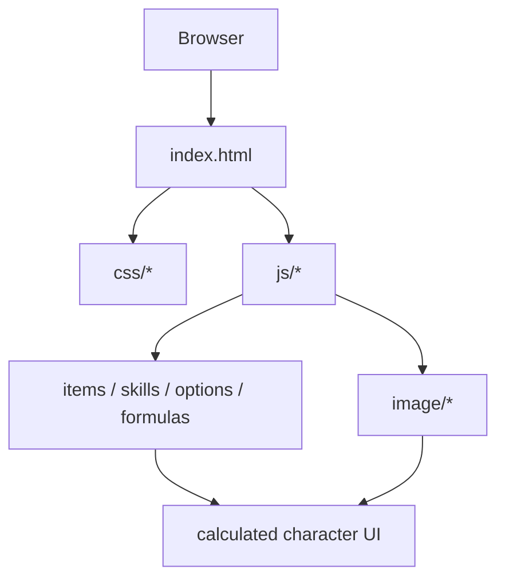
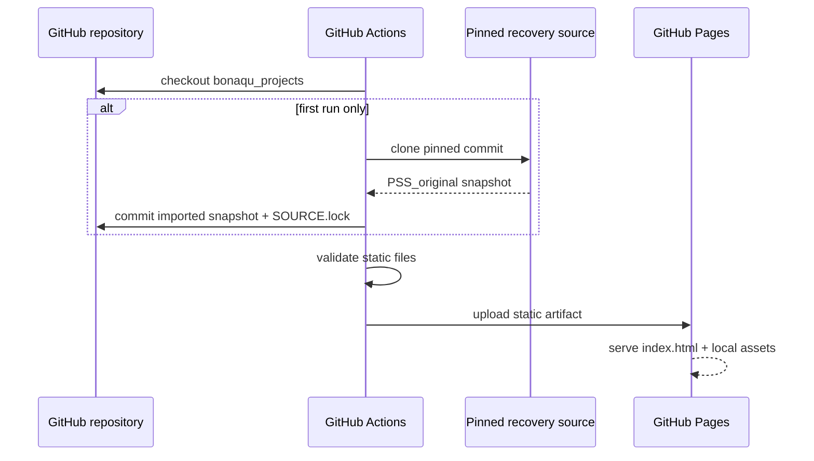

# Architecture

## Summary

Pandora Saga Simulator is a static, browser-side application. The restored deployment has no application server, PHP runtime or database.

## Main components

### `index.html`

The recovered legacy UI and entry point. GitHub Pages serves it from the repository root.

### `js/`

Contains the original client-side behavior and data. Important recovered files include:

- `calc.js` — calculated values / derived-stat logic;
- `equip.js` — equipment handling;
- `item.js` — item data;
- `skill.js` — skill data/behavior;
- `ini.js` — initialization data;
- `option.js` / `bonus.js` — option and bonus data;
- utility libraries used by the legacy client.

### `css/`

The original simulator themes/styles.

### `image/`

Legacy local image assets and item/skill icons.

## Deployment path

## Why no backend?

All known recovered simulator behavior is implemented in client-side files. Adding a server would increase maintenance and cost without improving preservation.

A backend should only be introduced for genuinely server-side features such as accounts, cross-device saved builds, public build IDs backed by persistent storage, or an API.

## Preservation boundary

The original calculator logic and data are treated as the preservation core. Hosting glue, documentation, CI and validation live around that core.

That separation makes it possible to modernize the project later without silently changing the preserved calculator.
