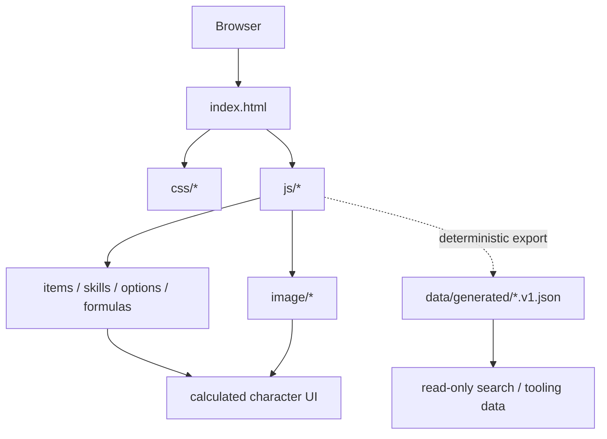
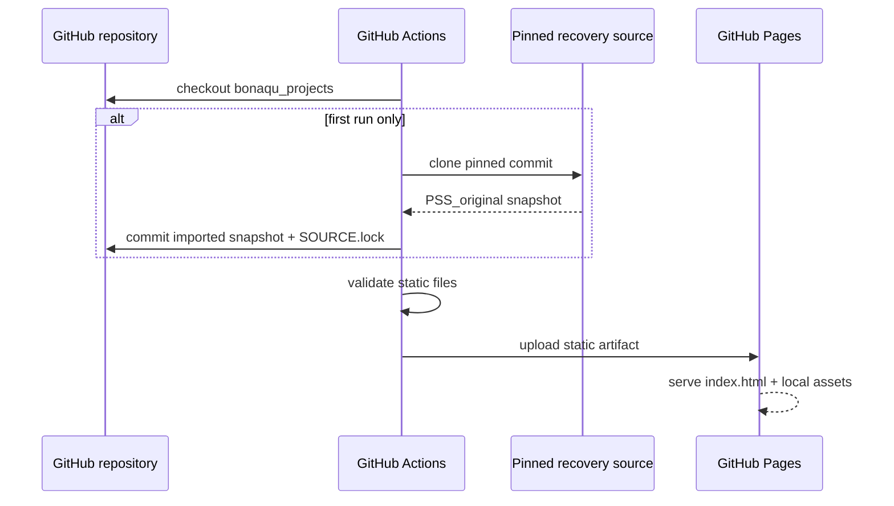

# Architecture

Modern share/installation metadata is injected only at the build boundary: absolute OG URL and a 1200×630 real-site PNG preview, PNG fallbacks of the preserved SVG PWA icons and a 180px Apple touch icon. Original Legacy HTML/assets are not rewritten for branding. The share preview is excluded from the bounded offline precache; installer icons remain available offline. Capture/export scripts and screenshot provenance live in `scripts/` and `docs/assets/screenshots/README.md`.

## Summary

Pandora Saga Simulator is a static, browser-side application. The restored deployment has no application server, PHP runtime or database.

## Main components

### `index.html`

The recovered legacy UI and entry point. GitHub Pages serves it from the repository root.

### `js/`

Contains the original client-side behavior and data. Important recovered files include:

- `calc.js` — calculated values / derived-stat logic;
- `equip.js` — equipment handling;
- `item.js` — item data;
- `skill.js` — skill data/behavior;
- `ini.js` — initialization data;
- `option.js` / `bonus.js` — option and bonus data;
- utility libraries used by the legacy client.

### `css/`

The original simulator themes/styles.

### `image/`

Legacy local image assets and item/skill icons.

### `data/generated/`

Versioned read-only projections of the live Legacy runtime for search and tooling. Equipment IDs map to the existing select values, Soul IDs remain unchanged and skill coordinates map directly to `Skill[*][category][entry]`. Each file carries deterministic source fingerprints; CRLF is normalized to LF before hashing so the fingerprint is stable across Windows and Linux checkouts.

Legacy JavaScript remains the sole calculation/data source of truth. The generated JSON is published as static data, is not injected into `/legacy/`, and is not used to reimplement formulas.

## Deployment path

### Translator input

`localization/translations.xlsx` is the translator's only editable source. The Pages builder validates all 2,828 rows against `ui.en.json` and the machine-exported Legacy term index, then generates `modern/locales.js` and `modern/game-terms.js`. Its 161 UI strings, 1,617 core game terms, 259 calculator labels, 158 hints and 633 skill-detail fields share stable IDs. `modern/calculator-labels.js` provides the exporter and display adapter with one source-to-DOM map. `modern/game-term-display.js` decorates Modern native lists, selected names, inherited labels and skill popups after Legacy redraws and build loads. It writes approved input as literal text, preserves control values and existing help nodes, and restores the selected JP/EN/TW source when leaving RU. It does not replace Legacy globals or calculation inputs; diagnostic Log output remains original.

Modern search, build manager, compare and Updates use native modal dialogs. The browser makes background content inert; a shared boundary handler wraps Tab/Shift+Tab at the dialog's focusable ends. Closing returns focus to the opener. Escape dismisses a focused stat tooltip before its parent dialog. A first-focusable skip link moves to the calculator main landmark. These are tested DOM/keyboard contracts, not a claim of full screen-reader conformance.

The service worker cache key includes a deterministic fingerprint of its precached files. Updating only workbook translations changes the generated catalogs and cache key, allowing the normal update notice to deliver them to existing offline installations.

## Why no backend?

All known recovered simulator behavior is implemented in client-side files. Adding a server would increase maintenance and cost without improving preservation.

A backend should only be introduced for genuinely server-side features such as accounts, cross-device saved builds, public build IDs backed by persistent storage, or an API.

## Preservation boundary

The original calculator logic and data are treated as the preservation core. Hosting glue, generated read-only projections, documentation, CI and validation live around that core.

That separation makes it possible to modernize the project later without silently changing the preserved calculator.

Three archived codec files (`base64.js`, `rawinflate.js`, `rawdeflate.js`) are CodeRepos Trac HTML snapshots containing their original source in numbered code tables. `scripts/recover_archived_javascript.py` extracts those source cells during Pages generation, decodes HTML entities and reverses Trac's non-breaking-space formatting. It rejects missing/incomplete tables. Repository snapshots and preservation hashes stay unchanged; published Modern and Legacy runtime copies receive the recovered original JavaScript. This is a transport recovery, with the existing compressed File format checked by browser round-trips.
