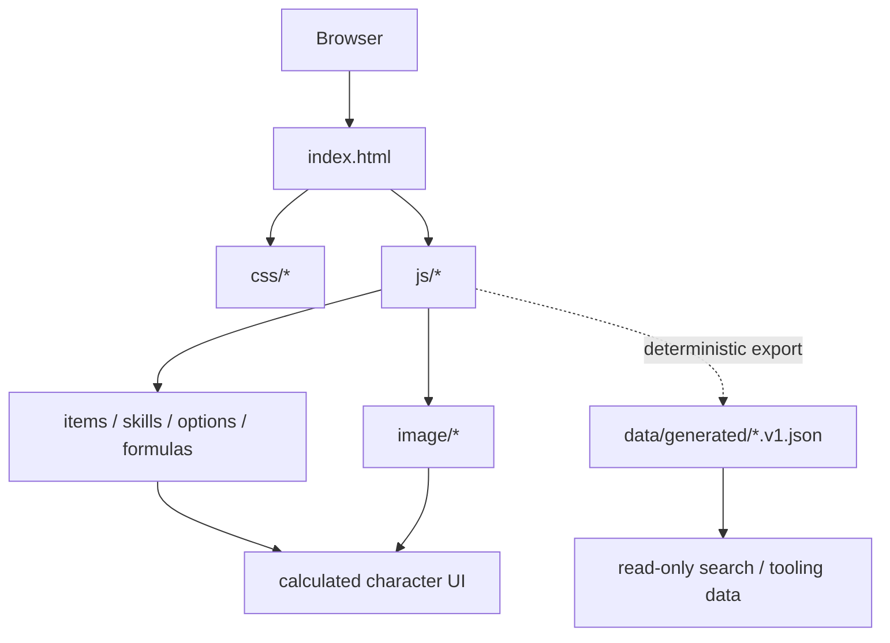
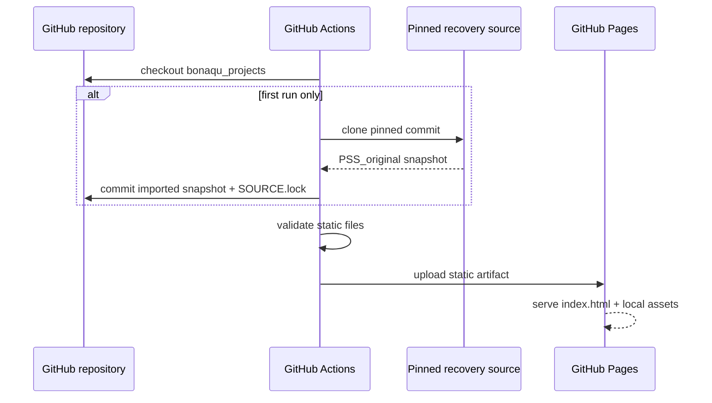

# Architecture

Modern share/installation metadata is injected only at the build boundary: absolute OG URL and a 1200×630 real-site PNG preview, PNG fallbacks of the preserved SVG PWA icons and a 180px Apple touch icon. Original Legacy HTML/assets are not rewritten for branding. The share preview is excluded from the bounded offline precache; installer icons remain available offline. Capture/export scripts and screenshot provenance live in `scripts/` and `docs/assets/screenshots/README.md`.

## Summary

Pandora Saga Simulator's public calculator is delivered as a static, browser-side GitHub Pages application. The preserved Legacy 2.00 engine and the Modern UI run in the browser. Modern may additionally read immutable public catalog revisions from a separate service; player use does not require an account, server-rendered application or PHP runtime.

## Main components

Modern Equipment selection is progressively enhanced by
`modern/equipment-picker.js`: native dialog lists with separate selection and
read-only characteristic actions reuse `modern/search.js`. Original numeric
selects/handlers remain the engine boundary and the fallback if enhancement is
unavailable. Soul availability follows Legacy SoulCheck, not the hidden state of
enhanced selects. Modern load rebuilds the existing equipment-effect cache via
`CalcSet('Equip')` before recalculation, avoiding stale prior-item effects without
copying formulas. The museum route remains unchanged.

### `index.html`

The recovered legacy UI and entry point. GitHub Pages serves it from the repository root.

### `js/`

Contains the original client-side behavior and data. Important recovered files include:

- `calc.js` — calculated values / derived-stat logic;
- `equip.js` — equipment handling;
- `item.js` — item data;
- `skill.js` — skill data/behavior;
- `ini.js` — initialization data;
- `option.js` / `bonus.js` — option and bonus data;
- utility libraries used by the legacy client.

### `css/`

The original simulator themes/styles.

### `image/`

Legacy local image assets and item/skill icons.

### `data/generated/`

Versioned read-only projections of the live Legacy runtime for search and tooling. Equipment IDs map to the existing select values, Soul IDs remain unchanged and skill coordinates map directly to `Skill[*][category][entry]`. Each file carries deterministic source fingerprints; CRLF is normalized to LF before hashing so the fingerprint is stable across Windows and Linux checkouts.

Legacy JavaScript remains the sole calculation/data source of truth. The generated JSON is published as static data, is not injected into `/legacy/`, and is not used to reimplement formulas.

## Deployment path

### Translator input

The protected RU/EN/JP/TW admin is the only translation editor. A verified immutable 2,920-ID snapshot in `localization/approved-translations.v1.json` holds the approved migration baseline, while Cloudflare D1 stores versioned per-ID edits and remains backward compatible with older publications. The Pages builder reads this JSON (never Excel) to generate `modern/locales.js` and `modern/game-terms.js`. `modern/game-term-display.js` translates Modern native lists, labels and skill popups while leaving the Legacy calculation engine and saved build data untouched.

The user's UI 2026.09.11 correction unifies the visible language control. EN selects source 1 and English UI; RU selects source 1 and Russian UI; JP/TW select source 0/2 and English UI. Internal i18n/Legacy APIs remain separate; stored UI-locale compatibility is retained. `adapter.readItemDetails` reads descriptions, socket count, class flags, literal base ATK/DEF and equipped customization from source arrays; `EquipOption` provides the existing enhanced name. Other candidates do not inherit current upgrades. Source descriptions and names are rendered as text, not executable HTML. Conditional formulas, final enhancement bonuses, client icons/prices/flavor absent from the source are not invented.

Build sharing uses validated `#build=` payloads through the safe-load adapter. A Modern `PS3` envelope pins its catalog revision; `C1` carries riding, effects, Honor, clan and caster context. Old numeric CSV/compressed codes retain compatibility and load with source-default context. Valid incoming links intentionally override local autosave; invalid links retain it. Clipboard denial exposes a manual copy input. This is not cloud storage, and anyone receiving the URL can read the character. Normal page navigation does not send URL fragments to the static host.

Modern search, build manager, compare and Updates use native modal dialogs. The browser makes background content inert; a shared boundary handler wraps Tab/Shift+Tab at the dialog's focusable ends. Equipment uses an anchored nonmodal dropdown instead; a delayed preview cancels on deliberate scrolling and review never equips an item. Closing returns focus to the opener. Escape dismisses a focused stat tooltip before its parent dialog. A first-focusable skip link moves to the calculator main landmark. These are tested DOM/keyboard contracts, not a claim of full screen-reader conformance.

The service worker cache key includes a deterministic fingerprint of its precached files. Publishing an updated immutable JSON baseline changes the generated catalogs and cache key; ordinary admin translations arrive from the public localized-override API without requiring a rebuild. Modern 3.11 checks the worker script without reusing its HTTP cache, activates real updates automatically and uses fresh navigation HTML to bridge clients still controlled by an older cached runtime. Normal navigation/refresh, returning to the tab or coming back online can therefore adopt the fresh cache without requiring Ctrl+F5.

## Backend boundary

The preserved calculator remains client-side. Legacy formulas, source item/skill arrays, build serialization and the museum route are not moved into a server-side reimplementation.

Modern can read a separate versioned catalog service for explicitly published catalog revisions. Those public revisions are treated as data inputs around the preservation core: saved/shared builds retain their pinned revision, and adopting a newer revision is an explicit action.

Player builds remain local to the browser unless the user deliberately exports or shares them. The public site does not require a player account or cloud-save backend. Private catalog-maintenance authentication and operating procedures are intentionally outside this public architecture document.

## Preservation boundary

Modern's `calculator-controls.js` decorates retained calculator nodes rather
than rebuilding the engine. Its native level/attribute/options buttons call
the original node's callback via `click()` exactly once; numeric fields, point
budgets, reset/load and serialized state remain source-owned. Responsive
containers and label/value pairs preserve every engine ID. If the enhancement
is unavailable, original inputs and callbacks remain visible and usable.

`skill-controls.js` requires that responsive calculator layout before adding
taller native branch rows, so a missing layout module keeps the whole source
canvas intact. All 240 skill actions delegate to retained source inputs.
Full branch names are rendered through the existing game-term projection.
Effect buttons retain original switching functions but remove hover-only
activation in Modern; percentages, next-SPR hints and engine IDs remain intact.

Riding and compressed Code export/clear use native buttons delegating once
to retained source handlers. Modern moves the actual Code field and handlers
into Build Manager, removing the second export/import interface. Modern replaces
only the Code Load DOM callback with `builds.importPreparedPayload`. It validates/rolls back
through the existing adapter and persists Modern autosave separately; it never
calls `File('CodeLoad')` or reads/writes compressed Legacy File slots. Source
label anchors remain available for stable translation IDs. Inline
feedback, input validation/focus and explicit unavailable-import fallback do
not change `File`, `Expand`, `Store`, codecs or museum behavior.
Versioned/context-bearing codes export the complete `PS3` envelope instead of
lossy compressed CSV. Plain source exports still use the exact native codec.
Code errors remain described next to the field when other manager actions run;
clearing the field does not delete named builds, FILE slots or character state.

The original calculator logic and data are treated as the preservation core. Hosting glue, generated read-only projections, documentation, CI and validation live around that core.

That separation makes it possible to modernize the project later without silently changing the preserved calculator.

Three archived codec files (`base64.js`, `rawinflate.js`, `rawdeflate.js`) are CodeRepos Trac HTML snapshots containing their original source in numbered code tables. `scripts/recover_archived_javascript.py` extracts those source cells during Pages generation, decodes HTML entities and reverses Trac's non-breaking-space formatting. It rejects missing/incomplete tables. Repository snapshots and preservation hashes stay unchanged; published Modern and Legacy runtime copies receive the recovered original JavaScript. This is a transport recovery, with the existing compressed File format checked by browser round-trips.
# Versioned Modern catalog layer

Modern can consume immutable public catalog revisions alongside the preserved Legacy source. This layer exists so verified data corrections can be published without rewriting the historical calculator files.

The old workbook was retired after its approved language values were validated against the versioned JSON migration baseline. New RU/EN/JP/TW wording is edited only in the authenticated admin, with immutable baseline fallback and versioned Cloudflare D1 overrides.

Catalog revisions are immutable public snapshots. Existing saved/shared builds keep their pin; explicit **Update current build** checks the current public head and preflights item, class/race compatibility and occupied Soul sockets before any runtime mutation. Named records are not rewritten automatically.

A failed or stale update cannot silently replace the character. Revision/context restoration, autosave safeguards and serialized build limits are enforced in the Modern adapter layer around the preserved engine.

Private catalog-maintenance authentication, credentials and publication procedures are deliberately not documented here. The public architecture only describes the player-visible data boundary and compatibility behavior.
